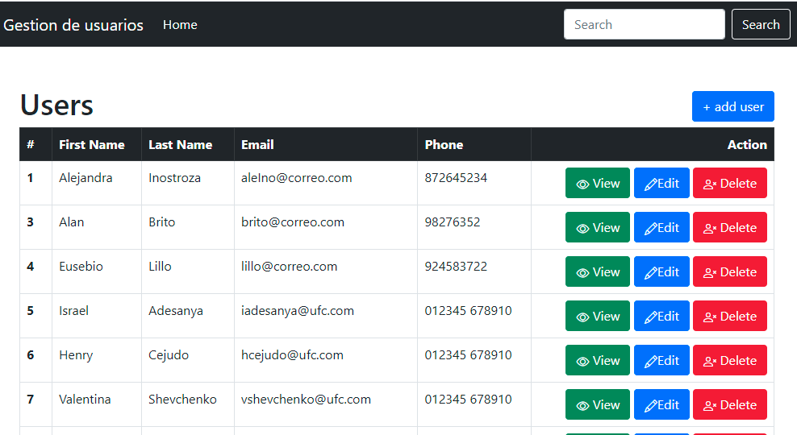
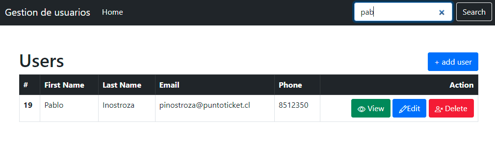
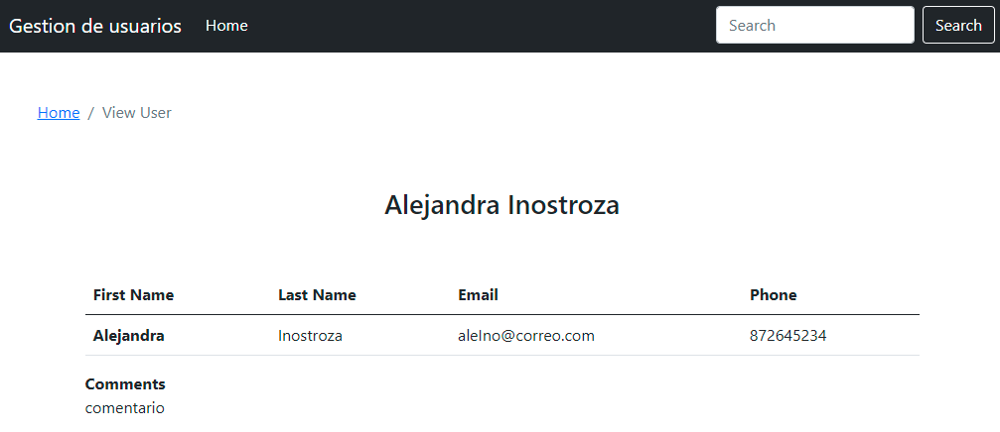
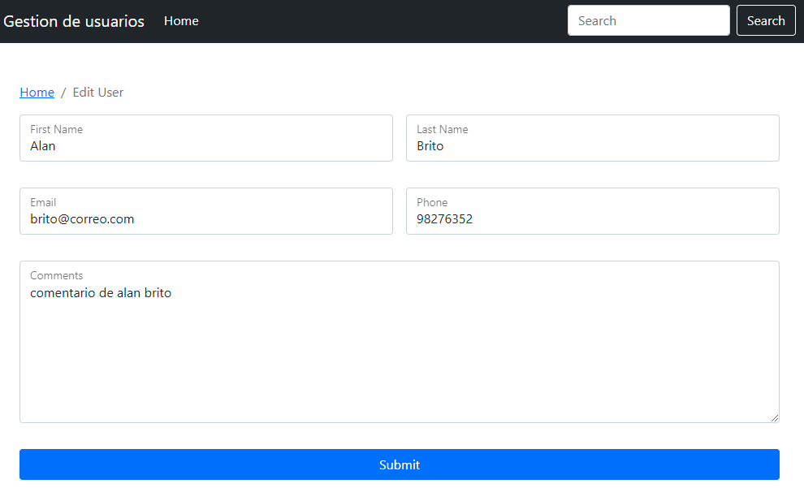
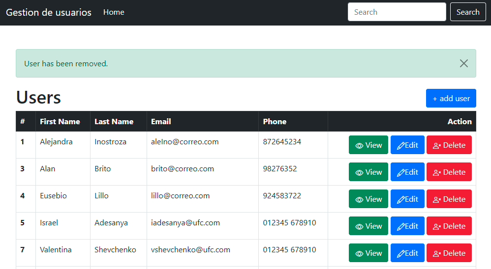

# Node.js gestión de usuarios - Express, Express-Handlebars, HBS, MySQL

## Crear archivo .env 
Crear archivo .env para guardar las credenciales de conexión a la bd mysql

```
DB_HOST = localhost
DB_NAME = namebd
DB_USER = root
DB_PASS = password
```

## Instalación
Para ejecutar este proyecto, ejecute localmente usando npm:

```
$ npm install
$ npm run dev
```


### Modulos
1-express <br>
2-mysql2 <br>
3-express-handlebars<br>
4-body-parser<br>
5-dotenv<br>






